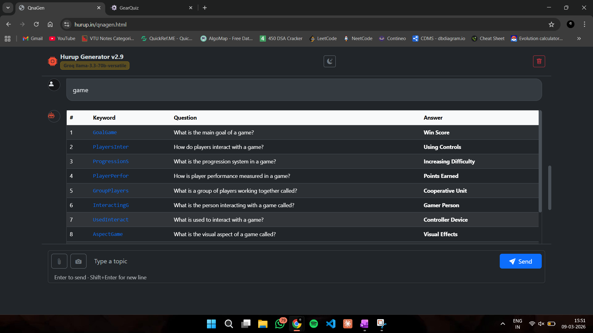
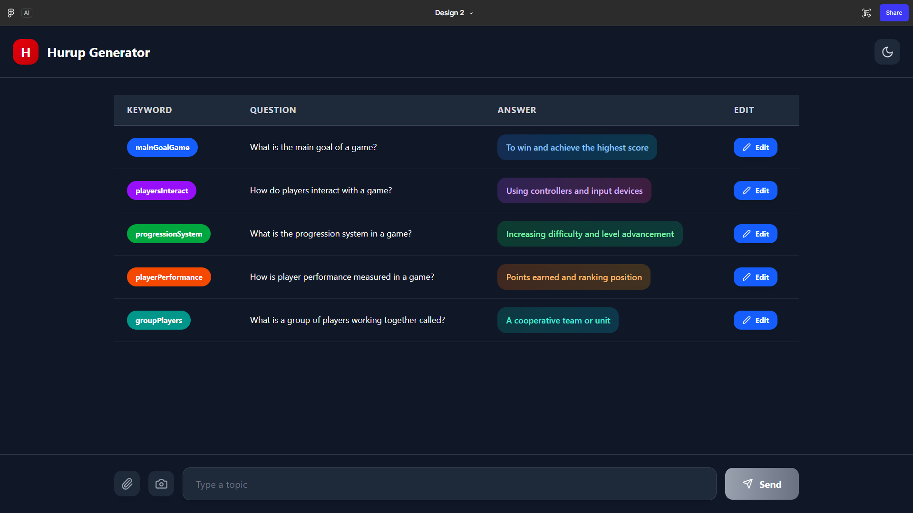
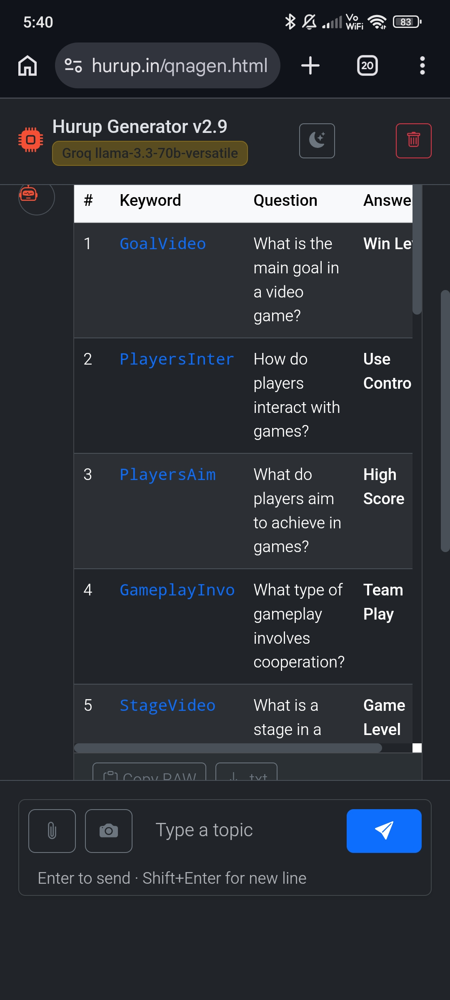
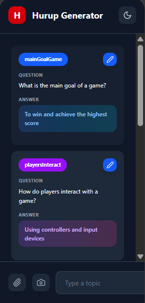

# 📱 Responsive UI Redesign – Hurup Generator

## Overview

This document describes the UI improvements made to the **Hurup Generator Question Editor**.

The goal of this update is to improve usability across **both desktop and mobile devices** while keeping the interface simple and intuitive.

The changes focus on:

- Improving **desktop table clarity**
- Creating a **mobile-friendly layout**
- Maintaining the **existing dark/light themes**
- Keeping all existing functionality such as editing, saving, and canceling questions

---

# 🎯 Design Goal

Create a **fully responsive UI** that works well across different screen sizes:

| Device | Layout |
|------|------|
| Desktop | Structured table layout |
| Tablet | Table layout |
| Mobile | Card-based stacked layout |

This approach ensures:

- Desktop users keep the efficient table workflow
- Mobile users get a readable, touch-friendly layout

---

# 🖥️ Desktop Layout

The desktop interface keeps the **tabular structure** for easy scanning and editing.

### Desktop UI Comparison

| Current Desktop UI | Improved Desktop UI |
|---|---|
|  |  |

---

## Desktop Improvements

### 1. Structured Table Layout

The question section uses a structured table:

| Column | Description |
|------|------|
| Keyword | Category tag for the question |
| Question | The generated question |
| Answer | Correct answer |
| Edit | Edit action |

---

### 2. Keyword Capsule Styling

Keywords are displayed as **capsule-shaped badges** with solid background colors.

Benefits:

- Easy visual grouping
- Color association with categories
- Clear distinction from question text

---

### 3. Answer Container Styling

Answers are shown inside a **rounded container** using a similar color scheme as the keyword.

Benefits:

- Improved readability
- Consistent color design
- Strong visual hierarchy

---

### 4. Edit Actions

Each row contains an **Edit button with a pencil icon**.

When editing:

- Question becomes editable
- Answer becomes editable
- Save and Cancel buttons appear

---

# 📱 Mobile Layout

Tables are difficult to read on small screens, so the mobile layout transforms each row into a **stacked card layout**.

---

## Mobile Layout Structure

Each question becomes a **card component**.

---

## Mobile UI Comparison

| Current Mobile UI | Improved Mobile UI |
|---|---|
|  |  |

---

## Mobile Design Improvements

### 1. Card-Based Layout

Each table row becomes a **card container**.

Benefits:

- Eliminates horizontal scrolling
- Improves readability
- Easier to interact with touch devices

---

### 2. Keyword Badge + Edit Icon

Top section of the card: (Game Goal)

This keeps important controls visible while saving space.

---

### 3. Question Section

Displayed below the keyword:
Question
What is the main goal of a game?

The text supports multiple lines for better readability.

---

### 4. Answer Container

Displayed as a highlighted container: 
Answer
(Win Score)

The color scheme matches the keyword badge.

---

### 5. Editing Mode on Mobile

When editing a question:
[ Game Goal ]

Question
[text input]

Answer
[text input]

[ Save ] [ Cancel ]

Inputs expand to **full width for easier typing**.

---

# 🎨 Theme Support

The responsive layout supports both existing themes.

---

## Dark Mode

Features:

- Dark background
- Colored keyword capsules
- Gradient answer containers
- Soft shadows

---

## Light Mode

Features:

- Light background
- Subtle borders
- Dark readable text

The **theme toggle continues to work exactly the same**.

---

# ⚙️ Implementation Strategy

The redesign uses **responsive layout techniques**.

Example concept:
Desktop → table layout
Mobile → stacked cards

The responsive breakpoints ensure that:

- Desktop UI remains unchanged
- Mobile UI adapts automatically

---

# ✅ Benefits of the Update

| Improvement | Benefit |
|------|------|
Better mobile readability | Questions no longer squeezed into columns |
Touch-friendly UI | Larger tap targets |
No horizontal scrolling | Cleaner mobile UX |
Consistent design | Same theme and colors |
Desktop unchanged | Existing workflow preserved |

---

# 🚀 Future Improvements (Optional)

Possible enhancements after this update:

- Drag-and-drop question ordering
- Animated card transitions
- Swipe gestures on mobile
- Bulk editing tools

---

# 📌 Summary

This redesign introduces a **fully responsive interface** for the Hurup Generator question editor.

The new layout:

- Keeps the **efficient desktop table**
- Adds a **mobile-friendly card layout**
- Maintains **all existing functionality**
- Improves **usability for smaller screens**

This ensures the application remains **easy to use across all devices**.

