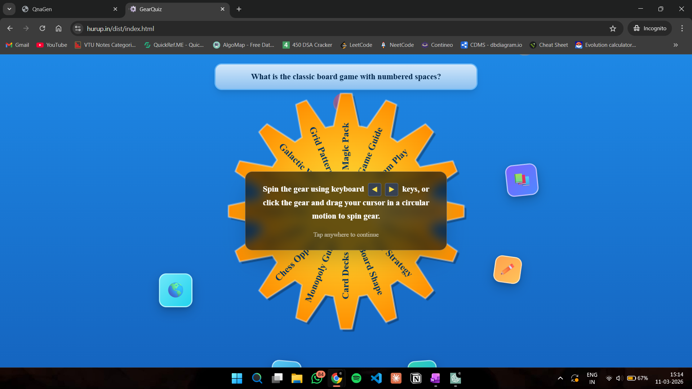
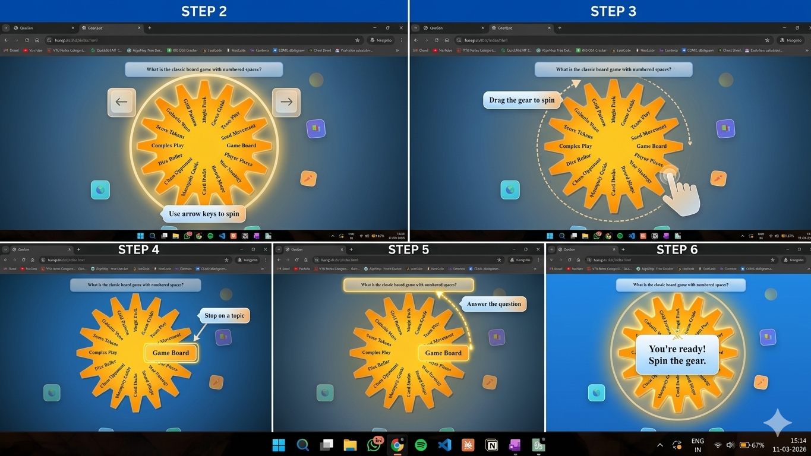
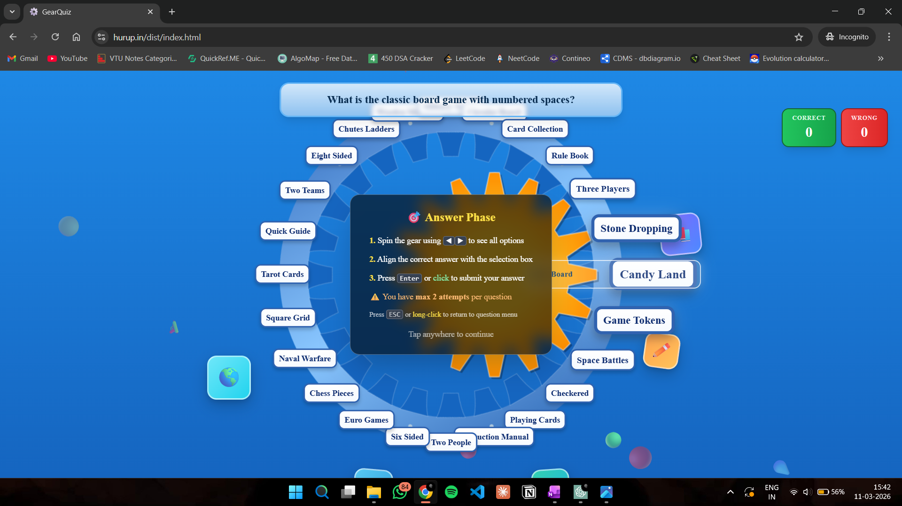
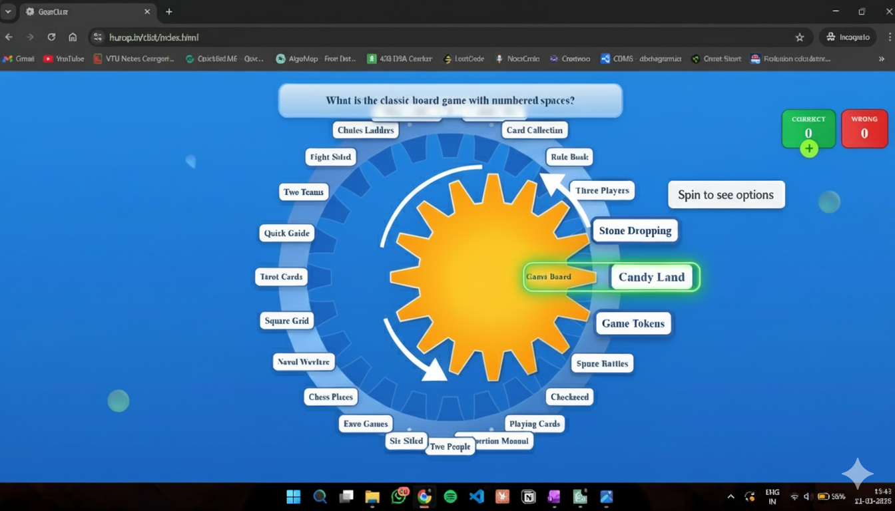

# 🎮 Interactive Tutorial Redesign – Gear Quiz Game

## Overview

This document describes the redesign of the **instruction system** in the Gear Quiz game.

Previously, the game used **large instruction popups** to explain how to play. While functional, this approach blocked the gameplay screen and required users to read multiple instructions before interacting with the game.

The new system replaces static instruction popups with **interactive onboarding tutorials** that guide the player step-by-step directly on the game interface.

This redesign improves:

- usability
- visual clarity
- onboarding experience
- player engagement

---

# Current vs Proposed Tutorial Design

## Spin Phase Tutorial

| Current Instruction Popup | New Interactive Tutorial |
|---|---|
|  |  |

### Issues with Current Design

The current instruction popup:

- blocks the game interface
- contains multiple instructions at once
- requires users to read before interacting
- reduces visual focus on the game elements

Example instruction:
"Spin the gear using keyboard arrow keys
or drag the gear with your cursor."

Although correct, this approach creates **cognitive friction for new players**.

---

# Redesigned Spin Tutorial

The new tutorial teaches the player **how to spin the gear through guided interaction**.

Instead of a popup, the system uses:

- glowing highlights
- directional arrows
- cursor animations
- short tooltips

### Step 1 – Discover the Gear

The gear wheel is highlighted with a glowing outline.

Tooltip: 
Although correct, this approach creates **cognitive friction for new players**.

---

# Redesigned Spin Tutorial

The new tutorial teaches the player **how to spin the gear through guided interaction**.

Instead of a popup, the system uses:

- glowing highlights
- directional arrows
- cursor animations
- short tooltips

### Step 1 – Discover the Gear

The gear wheel is highlighted with a glowing outline.

Tooltip: Spin the gear

A rotating arrow animation appears around the gear to indicate the spinning action.

---

### Step 2 – Keyboard Interaction

Keyboard arrow icons appear near the gear.

Tooltip: 
A rotating arrow animation appears around the gear to indicate the spinning action.

---

### Step 2 – Keyboard Interaction

Keyboard arrow icons appear near the gear.

Tooltip: Use ← → to spin

The gear slightly rotates to visually demonstrate the effect.

---

### Step 3 – Mouse Interaction

A cursor icon appears touching the gear.

A curved motion arrow demonstrates dragging the gear.

Tooltip: Drag to spin

---

### Step 4 – Selecting a Topic

One gear segment becomes highlighted.

Tooltip: stop on a topic

This explains how the topic selection works.

---

### Step 5 – Question Phase

An arrow appears pointing toward the question box.

Tooltip: Answer the topic

---

### Step 6 – Tutorial Completion

All highlights fade out.

Final hint: You're ready! spin the gear

---

# Answer Phase Tutorial

| Current Instruction Popup | New Interactive Tutorial |
|---|---|
|  |  |

---

## Problems with the Current Answer Instruction

The current instruction popup explains the answer phase using a large text box.

Example instructions:
Spin the gear using arrow keys
Align the correct answer
Press Enter to submit

Issues:

- blocks the gameplay area
- contains too many steps at once
- relies on reading instead of interaction

---

# Redesigned Answer Tutorial

The new tutorial guides the user using **highlighted UI elements** and **animated hints**.

---

### Step 1 – Understanding the Answer Wheel

The inner gear wheel (answer selector) is highlighted.

Tooltip: Spin to see the answer

Curved arrows show the rotation direction.

---

### Step 2 – Rotating the Answers

Keyboard arrow icons appear near the wheel.

Tooltip: Use ← → to rotate answers

The answer wheel rotates slightly to demonstrate the effect.

---

### Step 3 – Aligning the Answer

The selection box where answers align becomes highlighted.

Tooltip: 
The answer wheel rotates slightly to demonstrate the effect.

---

### Step 3 – Aligning the Answer

The selection box where answers align becomes highlighted.

Tooltip: Align the correct answer here

An arrow connects the spinning wheel to the selection box.

---

### Step 4 – Submitting the Answer

The selection box pulses slightly.

Tooltip: Press enter or click to submit 

A small click animation demonstrates submission.

---

### Step 5 – Attempts Indicator

The scoreboard area is highlighted.

correct 
Wrong

Tooltip: You have 2 attempts 

This helps players understand the scoring system.

---

### Step 6 – Start Playing

All tutorial elements fade out.

Final hint: Try answering now!

The answer wheel gently glows to encourage interaction.

---

# Visual Design Principles

The redesigned tutorial follows modern game onboarding patterns.

Key principles:

### Minimal Text

Instructions are reduced to short hints.

Example:
Spin the gear
Drag to spin
Align answer
Submit

---

### Contextual Guidance

Instructions appear **exactly where the action happens**.

Examples:

- gear highlights
- answer wheel glow
- selection box indicator

---

### Animated Feedback

Animations help demonstrate interactions.

Examples:

- rotating arrows
- cursor drag motion
- pulsing highlights

---

### Non-blocking UI

The tutorial does not cover the entire screen.

Players can still see the game interface during onboarding.

---

# Benefits of the Redesign

| Improvement | Impact |
|---|---|
Better onboarding | Players understand mechanics faster |
Reduced cognitive load | Less reading required |
Modern UX | Similar to mobile game tutorials |
Higher engagement | Encourages immediate interaction |
Clearer guidance | Highlights exact interactive elements |

---

# Future Improvements

Possible future enhancements include:

### Animated Demonstration Mode

The gear could automatically spin once to demonstrate interaction.

---

### Progressive Tutorials

Instead of showing everything at once, introduce instructions only when needed.

Example:

1. Spin tutorial
2. Topic selection tutorial
3. Answer tutorial

---

### Skip Option

Allow experienced players to skip tutorials.

---

# Summary

The new onboarding system replaces traditional instruction popups with an **interactive tutorial experience**.

Players now learn the game mechanics by:

- observing highlighted UI elements
- following animated hints
- interacting directly with the game interface

This approach creates a **smoother and more engaging first-time user experience**.
